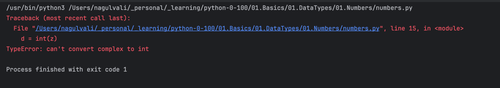

# Python Numbers
- There are three numeric types in Python:
  - int
  - float
  - complex


## Int
- Int, or integer, is a whole number, positive or negative, without decimals, of unlimited length

```python
x = 1
y = 35656222554887711
z = -3255522

print(type(x))
print(type(y))
print(type(z))
```

## Float
- Float, or "floating point number" is a number, positive or negative, containing one or more decimals.
```python

x = 1.10
y = 1.0
z = -35.59

print(type(x))
print(type(y))
print(type(z))
```

## Complex
- Complex numbers are written with a "j" as the imaginary part:
```python
x = 3+5j
y = 5j
z = -5j

print(type(x))
print(type(y))
print(type(z))
```

## Type Conversion
- You can convert from one type to another with the int(), float(), and complex() methods:
```python
x = 1    # int
y = 2.8  # float
z = 1j   # complex

#convert from int to float:
a = float(x)

#convert from float to int:
b = int(y)

#convert from int to complex:
c = complex(x)

# we can not convert complex to float or complex to int
# d = int(z)
# d = float(z)


print(a)
print(b)
print(c)

print(type(a))
print(type(b))
print(type(c))
```
- we can not convert complex to float or complex to int



## Random
- Python does not have a random() function to make a random number, but Python has a built-in module called random that can be used to make random numbers:
```python
import random

print(random.randrange(1, 10))
```

## Type Casting
- There may be times when you want to specify a type on to a variable. This can be done with casting.
- Python is an object-orientated language, and as such it uses classes to define data types, including its primitive types.
- Casting in python is therefore done using constructor functions:
  - int() - constructs an integer number from an integer literal, a float literal (by removing all decimals), or a string literal (providing the string represents a whole number)
  - float() - constructs a float number from an integer literal, a float literal or a string literal (providing the string represents a float or an integer)
  - str() - constructs a string from a wide variety of data types, including strings, integer literals and float literals

### Integers
```python
x = int(1)   # x will be 1
y = int(2.8) # y will be 2
z = int("3") # z will be 3
```

### Floats
```python
x = float(1)     # x will be 1.0
y = float(2.8)   # y will be 2.8
z = float("3")   # z will be 3.0
w = float("4.2") # w will be 4.2
```

### Strings
```python
x = str("s1") # x will be 's1'
y = str(2)    # y will be '2'
z = str(3.0)  # z will be '3.0'
```