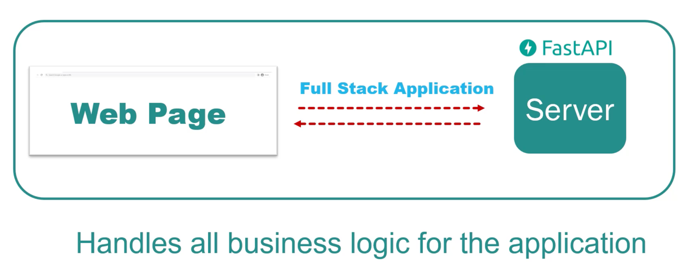

# Fast API
- FastAPI is a python web-framework for building modern APIs
  - Fast (Performance)
  - Fast (Development)
    - Data validation
    - Serialization
    - Documentation
  - Easy (Learning)
  - Short (Code)
  - Robust (Production-ready)
- FastAPI is based on Starlette and Pydantic
- FastAPI is asynchronous and supports both synchronous and asynchronous code
- FastAPI is built on top of standard Python type hints
- [Official Documentation](https://fastapi.tiangolo.com/)

## Installation
- Install FastAPI and an ASGI server like uvicorn
```bash
pip install fastapi uvicorn
```

## Fast API in Applicaiton Architecture




## Projects
- [Bookstore API](./BookstoreAPI)
 
